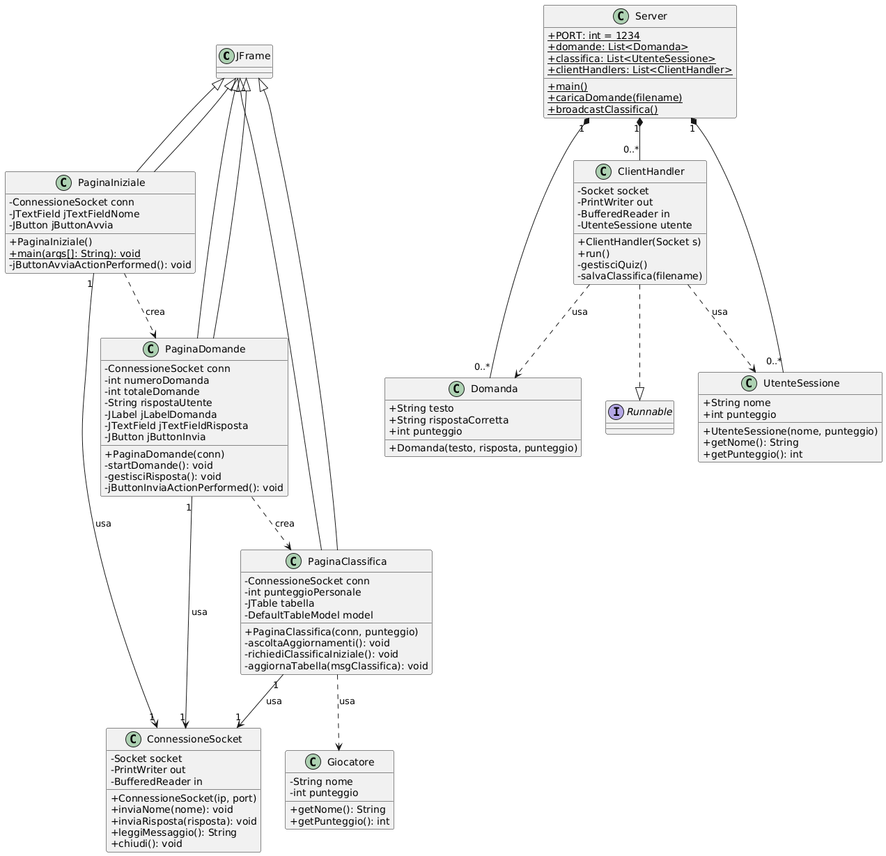
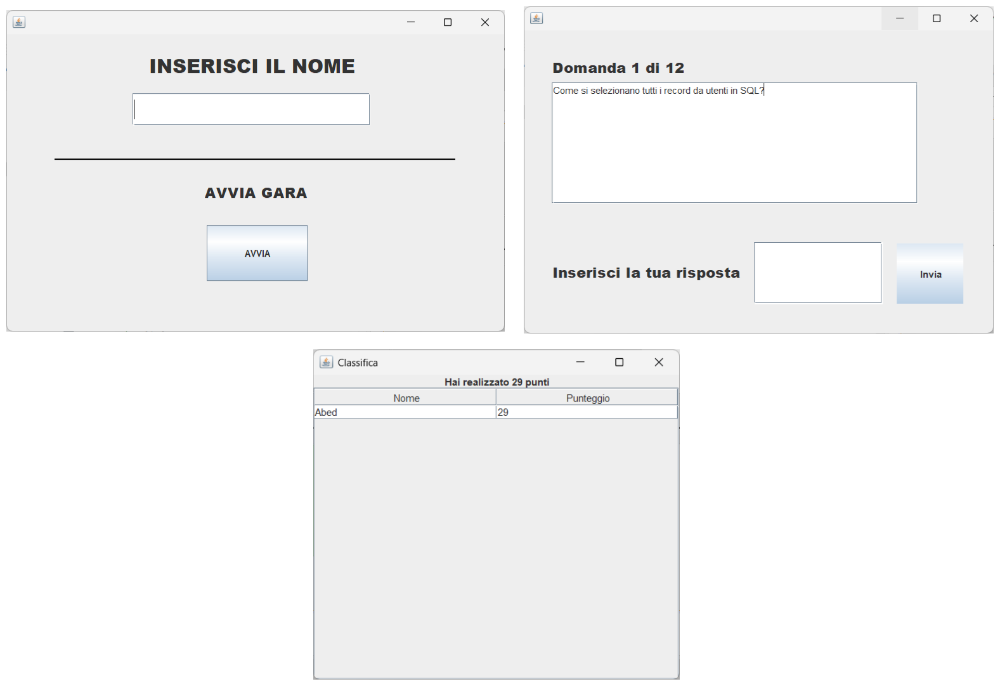

# Documentazione progetto

## Gara di programmazione

## 1. Introduzione

Il progetto implementa un sistema di **Gara di quiz di programmazione multi-utente**  basato su architettura **Client-Server** utilizzando **Sockets in Java**. 
I partecipanti, dopo aver effettuato l'accesso con un nome, sono sottoposti a una serie di domande di programmazione pre-caricate, ciascuna con un punteggio assegnato. 
Una volta che i partecipanti terminano di rispondere a tutte le domande, il sistema calcola il loro punteggio totale e aggiorna in tempo reale una **classifica globale** visualizzata su tutti i client connessi.

## 2. Team di Sviluppo

| **Membro** | **Ruolo** |
| --- | --- |
| **Simone Fusar Bassini** | Backend Developer |
| **Andrea Cornetti** | Frontend Developer |

---

## 3. Requisiti

### 3.1 Requisiti Funzionali (RF)

| **ID** | **Descrizione** |
| --- | --- |
| **RF1** | **Avvio del sistema**: Il progetto deve avviarsi e funzionare correttamente. |
| **RF2** | **Avvio del server**: Il server deve avviarsi correttamente e rimanere in ascolto per le connessioni dei client sulla porta designata (1234). |
| **RF3** | **Avvio del client**: Il client deve avviarsi correttamente e mostrare l’interfaccia grafica (GUI) iniziale (`PaginaIniziale`). |
| **RF4** | **Inserimento nome**: All’avvio, il client deve richiedere all’utente l’inserimento del proprio nome e inviarlo al server subito dopo la connessione. |
| **RF5** | **Lettura domande**: Il server deve leggere correttamente da un file di testo (`questions.txt`) le domande, le risposte corrette e i relativi punteggi. |
| **RF6** | **Invio domande casuali**: Il server deve mescolare le domande  e inviarle al client una per una, in ordine casuale. |
| **RF7** | **Visualizzazione domande**: Il client (`PaginaDomande`) deve visualizzare correttamente le domande ricevute dal server, aggiornando il contatore della domanda corrente. |
| **RF8** | **Invio risposte**: Il client deve inviare correttamente le risposte dell’utente al server tramite il pulsante "Invia". |
| **RF9** | **Calcolo punteggio**: Il server deve assegnare un punteggio totale in base alla corrispondenza tra le risposte inviate dal client e le risposte corrette . |
| **RF10** | **Classifica**: Il server deve salvare il punteggio, aggiornare la classifica globale e inviare un broadcast di aggiornamento a tutti i client attivi quando un partecipante termina il quiz. |
| **RF11** | **Visualizzazione classifica**: Il client (`PaginaClassifica`) deve visualizzare correttamente la classifica finale in ordine decrescente di punteggio. |

### 3.2 Requisiti Non Funzionali (RNF)

| **ID** | **Descrizione** |
| --- | --- |
| **RNF1** | **Prestazioni**: La comunicazione tra client e server deve avvenire senza ritardi percepibili e il cambio schermata deve avvenire in meno di 1 secondo. |
| **RNF2** | **Robustezza**: Il sistema deve continuare a funzionare correttamente anche in caso di input imprevisti, vuoti o incompleti. |
| **RNF3** | **Stabilità**: Il sistema deve mantenere una connessione stabile tra client e server per tutta la durata del quiz.  |

---

## 4. Analisi del Sistema

### 4.1 Ingegneria del Software: Casi d'Uso

Descrizione delle interazioni fondamentali tra l'utente e il sistema Quiz.

| **ID** | **Caso d'Uso** | **Attore/i Primario/i** | **Responsabilità nel Sistema** |
| --- | --- | --- | --- |
| **UC1** | **Avvia Sessione di Gioco** | Partecipante | L’utente avvia la trasmissione |
| **UC2** | **Somministra Quiz Casuale** | Server | Il server pone le domande in ordine casuale. |
| **UC3** | **Registra e Calcola Risultato** | Server | Il server calcola il risultato e aggiorna la classifica |
| **UC4** | **Richiede Classifica Corrente** | Partecipante | Il client richiede la classifica aggiornata |
| **UC5** | **Trasmette Aggiornamento Classifica** | Server | Il server manda la classifica in aggiornata in funzione di UC3 e UC4 |
| **UC6** | **Visualizza Classifica Aggiornata** | Partecipante | L’utente ottiene(UC5) e visualizza la classifica aggiornata. |
| **UC7** | **Chiusura** | Partecipante | L’utente chiude la pagina e chiude quindi anche la connessione |

### 4.2 Diagramma delle Classi

Ci sono 2 progetti , uno per il client e uno per il server

### Server

- **Server** : Gestisce la logica globale, le liste e il *broadcast*.
- **ClientHandler** : Gestisce ogni singola connessione.
- **Domanda** : Struttura dati per le domande.
- **UtenteSessione** : Struttura dati per i risultati (nome e punteggio).

### Client

- **PaginaIniziale**, **PaginaDomande**, **PaginaClassifica** : Interfacce utente.
- **ConnessioneSocket** : Classe per la gestione della socket lato client.

### 4.3 Mockup e Wireframe dell'Interfaccia

### Wireframe

### Mockup

---

## 5. Tecnologie Usate

La totalità del progetto (Frontend GUI e Backend Server) è stata sviluppata in **JAVA**, sfruttando le librerie standard per la gestione delle interfacce grafiche (**Swing**) e delle comunicazioni di rete (**java.net**).

---

## 6. Protocollo Applicazione e Implementazione

### 6.1 Protocollo

Il protocollo si basa sullo scambio di stringhe testuali su Sockets TCP in Java. Il ricevente (Client o Server) deve sempre leggere l'intera stringa e usare i prefissi o la posizione per interpretarne il contenuto.
**1. Messaggi Strutturati (con Tag e Delimitatore `|`)**
Questi messaggi utilizzano un prefisso seguito dal delimitatore verticale (`|`) per identificare il tipo di dato e separarlo dal contenuto utile.

 La stringa completa, comprensiva del tag, viene trasmessa sul socket.

| **Mittente → Destinatario** | **Tag/Tipo di Messaggio** | **Sintassi Esatta Inviata** | **Dati Contenuti** |
| --- | --- | --- | --- |
| **S → C** | **DOMANDA** | `"DOMANDA| | " + d.testo` (testo della domanda) |
| **S → C** | **PUNTEGGIO** | `"PUNTEGGIO| | " + punteggioTotale` (punteggio realizzato da quell’utente) |
| **S ↔ C** | **CLASSIFICA** | `"CLASSIFICA| | " + classifica |

**2. Messaggi Semplici (Stringa Unica)**
Questi messaggi sono stringhe inviate senza un tag specifico

| **Mittente → Destinatario** | **Tipo di Messaggio** | **Sintassi Esatta Inviata** | **Dati Contenuti** |
| --- | --- | --- | --- |
| **C → S** | **Nome Utente** | `nome` (Stringa letta da `in.readLine()`) | Stringa contenente il nome inserito dal giocatore. |
| **C → S** | **Risposta Utente** | `risposta` (Stringa letta da `in.readLine()`) | Stringa contenente la risposta testuale. |
| **C → S** | **Comando Richiesta Classifica** | `"DAMMI_CLASSIFICA"` | Comando per forzare il Server a inviare la classifica subito. |
| **C → S** | **Comando Chiusura** | `"CHIUDI_CONNESSIONE"` | Comando per segnalare la disconnessione controllata al Server. |

## Sequenza di Esecuzione del Protocollo

Il protocollo si svolge in tre fasi principali: **Inizializzazione**, **Quiz** e **Post-Quiz/Terminazione**. Questa sequenza è gestita principalmente dal `ClientHandler` sul lato Server, che esegue la logica del quiz per ogni utente in un thread separato.

### Fase 1: Inizializzazione e Identificazione

1. **Connessione Client:** Il Client stabilisce la connessione TCP sulla porta designata (1234).
2. **Invio Nome (C → S):** Il Client invia immediatamente il **Nome Utente** (`nome`) al Server. *Questo è il primo messaggio letto dal Server.*

### Fase 2: Svolgimento del Quiz

1. **Invio Domanda (S → C):** Il `ClientHandler` invia la prima domanda casuale utilizzando il tag **DOMANDA** (`DOMANDA|testo...`).
2. **Invio Risposta (C → S):** Il Client invia la **Risposta Utente** (`risposta`) al Server dopo che l'utente ha premuto "Invia".
3. **Ciclo:** I passi sopra  vengono ripetuti per tutte le domande (`totaleDomande = 10`).

### Fase 3: Conclusione e Classifica

1. **Calcolo e Notifica Punteggio (S → C):** Terminato il ciclo, il Server calcola il punteggio, aggiorna la classifica globale e invia il punteggio finale all'utente con il tag **PUNTEGGIO** (`PUNTEGGIO|punteggio`)
2. **Richiesta Classifica (C → S):** Dopo il quiz, la `PaginaClassifica` si apre e invia il comando **"DAMMI_CLASSIFICA"** al Server per assicurarsi di ricevere la classifica più recente..
3. **Broadcast Classifica (S ↔ C):** Il Server chiama `broadcastClassifica()`, inviando il messaggio **CLASSIFICA** (`CLASSIFICA|...`) a *tutti* i client attivi.
4. **Ascolto Classifica (S → C):** Il Client rimane in ascolto nel thread dedicato e riceve gli aggiornamenti **CLASSIFICA** 
5. **Terminazione (C → S):** Alla chiusura della finestra, il Client invia il comando **"CHIUDI_CONNESSIONE"**, permettendo al Server di chiudere il `ClientHandler` e la socket in modo controllato.

### 6.2 Struttura Cartelle

La struttura del progetto è divisa in due moduli principali, Client e Server.

| **Modulo** | **File Principali** | **Descrizione** |
| --- | --- | --- |
| **/Server** | `Server.java`, `ClientHandler.java` | Logica Server e gestione thread I/O. |
|  | `Domanda.java`, `UtenteSessione.java` | Classi utilizzate dalle altre 2 |
|  | `questions.txt`, `classifica.txt` | Domande e classifica |
| **/Client** | `ConnessioneSocket.java` | Gestione socket |
|  | `PaginaIniziale.java`, `PaginaDomande.java`,
`PaginaClassifica.java`,  | GUI  |
|  | `Giocatore.java` | Struttura del giocatore per visualizzare la classifica |

---

## 7. Installazione e Configurazione

1. **Download**: Scaricare i progetti compressi (zip) di `Client` e `Server` e decomprimerli.
2. **Apertura**: Aprire entrambi i progetti nell'IDE NetBeans.
3. **Esecuzione Server**: Eseguire prima il progetto **Server**. Il server si avvierà in ascolto sulla porta **1234**. — Come main mettere Server.java
4. **Esecuzione Client**: Eseguire uno o più progetti **Client** in contemporanea. — Come main mettere Client.java

### Configurazione per Rete (Macchine Differenti)

Per utilizzare il quiz su computer differenti in rete locale, è necessario:

1. **Server**: Individuare l'indirizzo IP locale del computer che funge da Server.
2. **Client**: Modificare il codice nella classe `PaginaIniziale.java` (metodo `jButtonAvviaActionPerformed`) sostituendo l'indirizzo IP di loopback (`"127.0.0.1"`) con l'indirizzo IP della macchina che sta eseguendo il Server
    
    `conn = new ConnessioneSocket("IP_DEL_SERVER", 1234);`
    

---

## 8. Manuale Utente

1. **Avvio**: Eseguire prima il progetto **Server**, poi il progetto **Client**.
2. **Login**: Interagire sul Client. Inserire il proprio nome nella casella di testo e premere il pulsante **AVVIA**.
3. **Quiz**: Rispondere alle domande che appaiono, inserendo la risposta nel riquadro e inviandola attraverso il bottone **Invia**.
4. **Risultato**: Al termine di tutte le domande, verrà visualizzato il punteggio totale ottenuto.
5. **Classifica**: La schermata si aggiornerà automaticamente mostrando la classifica globale, che continuerà ad aggiornarsi in tempo reale non appena altri partecipanti termineranno il quiz.

---

## 9. Conclusioni

Il progetto ha consentito di applicare e approfondire le competenze in programmazione **Java**, concentrandosi sulla **comunicazione di rete** e la **programmazione concorrente** tramite **Sockets** e **Thread**.
La parte più complessa è stata sicuramente come mostrare la classifica
